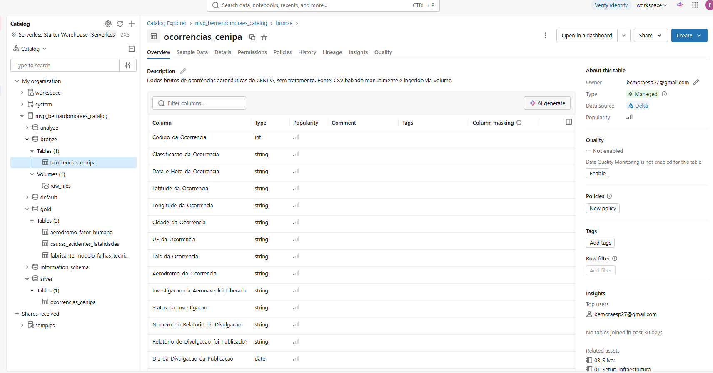

# MVP – Engenharia de Dados de Ocorrências Aeronáuticas (CENIPA)

**Observação:** A seguir terão informações de Carga de Dados, Pipeline, Modelagem, Catálogo de Dados e Qualidade dos Dados. Informação referentes a Contexto de Negócio, Análise e Autoavaliação estarão em notebook dentro da estrutura do databricks.

**Plataforma:** Databricks (Unity Catalog).

 **Catalog:** `mvp_bernardomoraes_catalog`. 
 
 **Fonte:** base de ocorrências aeronáuticas do CENIPA

**Perguntas de negócio que guiaram o pipeline:**

**Pergunta 1:** `Quais causas de acidentes geram maior gravidade (com maior número de feridos)? Para assim conseguirmos direcionar quais causas devemos investigar e tentar ao máximo mitigar.`

**Pergunta 2:** `Quais os fabricantes ou modelos de aeronaves com maior incidencia de acidentes relacionadas a questões técnicas/de infraestrutura do avião.`

**Pergunta 3:** `Quais aeroportos tem maiores incidentes relacionados a funcionários/erros humanos? Com intuito de priorizarmos treinamentos nesses locais.`

---

## Carga dos Dados

**Origem:** Os dados utilizados foram obtidos no Kaggle, referente ao Dataset de Acidentes no Espaço Aéreo Brasileiro (Cenipa), segue o link para o dataset: https://www.kaggle.com/datasets/markfinn1/acidentes-areos/data?select=Cenipa.csv

**Como foi feita:**
1. Criação da estrutura no Unity Catalog (catalog, schemas e um Volume para arquivos brutos).
2. **Upload manual** do CSV para o Volume `mvp_bernardomoraes_catalog.bronze.raw_files`.
3. Leitura com Spark (`sep=";"`, `header=True`, `inferSchema=True`, `encoding="UTF-8"`).
4. Padronização dos nomes de coluna (espaços e caracteres inválidos trocados por `_`), exigência do formato Delta, que rejeita esses caracteres.
5. Gravação como tabela Delta gerenciada `bronze.ocorrencias_cenipa` (`mode("overwrite")`).
6. Validação pós-carga: contagem de linhas, número de colunas e `printSchema()`.

**Decisão de projeto:** a bronze guarda o dado **como veio** (valores, tipos inferidos, placeholders), alterando apenas os nomes das colunas por restrição técnica do Delta. Todo tratamento de conteúdo fica para a silver.

**Limitação conhecida:** a carga é manual. Como evolução, o download poderia ser automatizado e o pipeline agendado (ver autoavaliação).

---

## Modelagem e Catálogo de Dados

### Organização (arquitetura medalhão)

| Nível | Nome | Função |
|---|---|---|
| Catalog | `mvp_bernardomoraes_catalog` | Contêiner de todo o projeto |
| Schema | `bronze` | Dado bruto, sem tratamento de conteúdo |
| Schema | `silver` | Dado limpo, tipado e padronizado |
| Schema | `gold` | Tabelas agregadas, uma por pergunta de negócio |
| Schema | `analyze` | Validações e consultas de conferência |
| Volume | `bronze.raw_files` | Armazena o CSV original |

📷 

### Tabelas

| Tabela | Granularidade | Descrição |
|---|---|---|
| `bronze.ocorrencias_cenipa` | 1 linha por ocorrência | Cópia fiel do CSV, com nomes de coluna ajustados |
| `silver.ocorrencias_cenipa` | 1 linha por ocorrência (`codigo_ocorrencia` é único) | Versão tratada: nomes em snake_case, nulos reais, datas e booleanos tipados, fabricante padronizado |
| `gold.causas_acidentes_fatalidades` | causa × área do fator | Acidentes e fatalidades por causa |
| `gold.fabricante_modelo_falhas_tecnicas` | fabricante × modelo × tipo de ocorrência técnica | Volume de ocorrências técnicas |
| `gold.aerodromo_fator_humano` | aeródromo × UF × área do fator | Ocorrências de fator humano/operacional por aeródromo |

### Catálogo de dados

| # | Coluna | Descrição |
|---|---|---|
| 1 | `codigo_ocorrencia` | Identificador único da ocorrência (sem nulos nem duplicados) |
| 2 | `classificacao_ocorrencia` | ACIDENTE, INCIDENTE ou INCIDENTE GRAVE |
| 3 | `data_e_hora_ocorrencia` | Data e hora da ocorrência |
| 4 | `latitude_ocorrencia` | Latitude (origem com formato corrompido, ver 4.5) |
| 5 | `longitude_ocorrencia` | Longitude (origem com formato corrompido, ver 4.5) |
| 6 | `cidade_ocorrencia` | Cidade da ocorrência |
| 7 | `uf_ocorrencia` | Estado (UF) |
| 8 | `pais_ocorrencia` | País (sempre BRASIL) |
| 9 | `aerodromo_ocorrencia` | Código do aeródromo; nulo quando não informado |
| 10 | `investigacao_aeronave_foi_liberada` | Se a aeronave foi liberada da investigação |
| 11 | `status_investigacao` | Situação da investigação |
| 12 | `numero_relatorio_divulgacao` | Número do relatório de divulgação |
| 13 | `relatorio_divulgacao_foi_publicado` | Se o relatório foi publicado |
| 14 | `dia_divulgacao_publicacao` | Data de divulgação da publicação |
| 15 | `total_recomendacoes` | Total de recomendações emitidas |
| 16 | `total_aeronaves_envolvidas` | Quantidade de aeronaves envolvidas |
| 17 | `ocorrencia_saida_pista` | Se ocorreu saída de pista |
| 18 | `tipo_ocorrencia` | Tipo da ocorrência (ex.: falha do motor em voo) |
| 19 | `tipo_categoria_ocorrencia` | Categoria do tipo de ocorrência |
| 20 | `taxonomia_tipo_icao` | Taxonomia ICAO do tipo |
| 21 | `matricula_aeronave` | Matrícula da aeronave |
| 22 | `categoria_operador_aeronave` | Categoria do operador |
| 23 | `tipo_aeronave` | Avião, helicóptero, ultraleve etc. |
| 24 | `fabricante_aeronave` | Fabricante (sem acento, maiúsculo, variações unificadas) |
| 25 | `modelo_aeronave` | Modelo da aeronave |
| 26 | `tipo_aeronave_icao` | Designador ICAO do tipo |
| 27 | `aeronave_motor_tipo` | Tipo de motor |
| 28 | `aeronave_motor_quantidade` | Quantidade de motores |
| 29 | `aeronave_pmd` | Peso máximo de decolagem |
| 30 | `categoria_pmd_aeronave` | Categoria por peso máximo de decolagem |
| 31 | `quantidade_assentos_aeronave` | Número de assentos |
| 32 | `ano_fabricacao_aeronave` | Ano de fabricação |
| 33 | `pais_fabricante_aeronave` | País do fabricante |
| 34 | `pais_registro_aeronave` | País de registro |
| 35 | `registro_categoria_aeronave` | Categoria de registro |
| 36 | `registro_segmento_aeronave` | Segmento de registro |
| 37 | `voo_origem_acidente` | Origem do voo |
| 38 | `voo_destino_acidente` | Destino do voo |
| 39 | `fase_operacao_aeronave` | Fase da operação na ocorrência |
| 40 | `tipo_operacao_aeronave` | Tipo de operação |
| 41 | `nivel_dano_aeronave` | Nível de dano da aeronave |
| 42 | `total_fatalidades_acidente` | Total de fatalidades |
| 43 | `fator_acidente` | Fator contribuinte específico (só em casos com investigação publicada) |
| 44 | `aspecto_fator_ocorrencia` | Aspecto do fator |
| 45 | `fator_condicionante` | Fator condicionante |
| 46 | `area_fator` | Área do fator (humano, operacional, material, outro) |
| 47 | `numero_recomendacao` | Número da recomendação |
| 48 | `dia_assinatura_recomendacao` | Data de assinatura da recomendação |
| 49 | `dia_encaminhamento_recomendacao` | Data de encaminhamento (nulo quando a origem trazia ano inválido) |
| 50 | `conteudo_recomendacao` | Texto da recomendação |
| 51 | `status_recomendacao` | Situação da recomendação |
| 52 | `orgao_recomendacao` | Órgão destinatário da recomendação |

---

## Pipeline de Dados

O pipeline foi **ramificado em notebooks por camada**, em vez de ficar em um único notebook. Isso separa responsabilidades, facilita reexecutar só a etapa necessária e deixa claro onde cada tratamento acontece.

| Ordem | Notebook | Responsabilidade | Saída |
|---|---|---|---|
| 0 | Setup (`ingest e preparação`) | Cria catalog, schemas (com comentários) e Volume | Estrutura no Unity Catalog |
| 1 | `bronze` | Lê o CSV do Volume, ajusta nomes de coluna e grava | `bronze.ocorrencias_cenipa` |
| 2 | `silver` | Análise exploratória e tratamentos de qualidade | `silver.ocorrencias_cenipa` |
| 3 | `gold` | Agregações por pergunta de negócio | 3 tabelas em `gold` |
| 4 | `analyze` | Checks de sanidade comparando gold com a exploração inicial | Validação documentada |
| 5 | Autoavaliação | Objetivos, dificuldades e trabalhos futuros | Texto |

**Fluxo:** `CSV (Volume) → bronze → silver → gold → analyze (validação)`

**Práticas adotadas**
- Em cada etapa de qualidade da silver, **exploração antes do tratamento**: primeiro se enxerga o problema, depois se corrige.
- Tabelas gravadas com `saveAsTable` (Delta, gerenciadas pelo Unity Catalog), com `COMMENT` na tabela e nos schemas.
- Validação pós-gravação (contagem de linhas e schema) e conferência cruzada entre silver e gold.

---

## Qualidade de Dados

Problemas detectados na exploração e como cada um foi resolvido.

| # | Problema detectado | Como foi detectado | Tratamento aplicado |
|---|---|---|---|
| 1 | **IDs nulos ou duplicados** | Contagem de nulos e de `codigo_ocorrencia` distintos | Nenhum problema encontrado; a chave é única e completa |
| 2 | **Nomes de coluna inválidos para Delta** (espaços, espaço no final, `?`) | Erro `DELTA_INVALID_CHARACTERS_IN_COLUMN_NAMES` na gravação | Regex trocando caracteres inválidos por `_`, já na bronze |
| 3 | **Nomes longos e inconsistentes** (Title_Case, conectores "da/de/do", `?` residual) | Listagem de todos os nomes | Padronização para snake_case minúsculo, remoção de conectores e do `?`, com checagem de colisão entre nomes (nenhuma encontrada) |
| 4 | **Placeholders de "não informado"** (`***`, `****`, `*****`, `####`, `###!`, `NULL` como texto, string vazia) | Distribuição de valores por coluna; só `aerodromo_ocorrencia` tinha 2.272 `****`, 165 `*****`, 13 `####` e 6 `###!` | Conversão para nulo real em todas as colunas de texto via regex (`^[\*#!\?]+$`), mais vazio e `NULL` textual |
| 5 | **Booleanos como texto** (`SIM`, `NÃO`, `***`, `NULL`) | Valores distintos das colunas | Conversão para boolean: `SIM`→true, `NÃO`→false, qualquer outro valor→nulo |
| 6 | **Variações de grafia do fabricante** (ex.: `AEROBRAVO`, `AEROBRAVO LTDA`, `AIRBUS`, `AIRBUS INDUSTRIE`, `BOEING COMPANY`, `FABRICACAO PROPRIA`/`FABRICAÇÃO PRÓPRIA`) e espaço sobrando | Agrupamento por fabricante ordenado por nome | Remoção de acentos, maiúsculas, `trim` e dicionário de-para para unificar variantes. `FABRICANTE DESCONHECIDO` virou nulo. Nomes de pessoas físicas foram mantidos (aeronaves de construção amadora) |
| 7 | **Erro de digitação em categoria** (`CONTATO ANORMAL COM A PISTAA`, 7 registros) | Distribuição de `tipo_ocorrencia` | Unificado com `CONTATO ANORMAL COM A PISTA` |

### Limitações de qualidade que permanecem
- Cerca de **81%** das ocorrências (4.962 de 6.114) não têm `fator_acidente` preenchido, porque só os casos com relatório de investigação publicado trazem fator causal. As análises de causa cobrem apenas os casos investigados, e a gold mantém a linha nula visível para não esconder esse gap.
- `aerodromo_ocorrencia` é nulo em uma parcela grande dos registros, o que limita a análise por aeroporto.
- A base traz apenas uma recomendação por ocorrência, embora `total_recomendacoes` indique que pode haver mais.
- Contagens por fabricante/modelo **não são normalizadas** pelo tamanho da frota.
